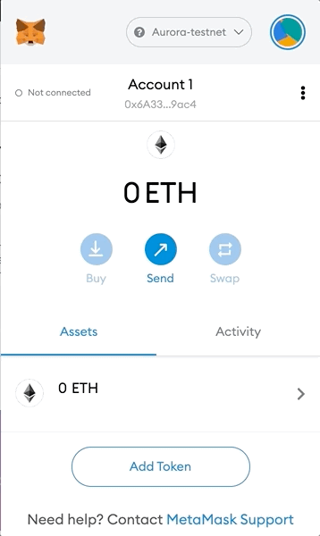
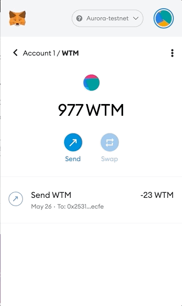

# ERC20 

This example is originally forked from [OpenZeppelin examples](https://docs.openzeppelin.com/contracts/4.x/erc20). However it implements the Watermelon token 🍉🍉. For more details about ERC20, please refer to [OpenZeppelin ERC20 implementation](https://github.com/OpenZeppelin/openzeppelin-contracts/tree/1b37c21da58f6379cfe09c0140cf56d67b19a0bc/contracts/token/ERC20).

The WaterMelonToken (WTM) 🍉🍉 contract inherits  OpenZeppelin's implementation for `ERC20`. The `constructor` mints the (1000 WTM tokens) and transfers them the `deployer` address.

## Installation

```
yarn 
```

## Getting Started

In order to run this example, you should:

- Set your `MNEMONIC` as env var as follows:
```
export MNEMONIC='YOUR MNEMONICS HERE'
```
- Add your Ethereum address in `truffle-config.js`:
```json
{...
    aurora: {
        provider: () => setupWallet('https://testnet.aurora.dev'),
        network_id: 0x4e454153,
        gas: 10000000,
        from: 'YOUR ETHEREUM ADDRESS HERE'
        },
}
```

- Run `yarn deploy:aurora`

You don't need to fund your address with ETH. You can execute your transactions by using the deploy command which sends your transaction to Aurora RPC relayer with zero gas fee. 

```bash
...
2_deploy_contracts.js
=====================

   Deploying 'WatermelonToken'
   ---------------------------
   > transaction hash:    0xd98e0e4131ba6c7e44711069ef9844b23a9f9d1b692413086b4ac3890deb8a9f
   > Blocks: 13           Seconds: 8
   > contract address:    0x49bA579A0d40793c61dF3E41FFcbAA60bf5f3C3A
   > block number:        49130208
   > block timestamp:     1622018606
   > account:             0x6A33382de9f73B846878a57500d055B981229ac4
   > balance:             0
   > gas used:            1236631 (0x12de97)
   > gas price:           20 gwei
   > value sent:          0 ETH
   > total cost:          0.02473262 ETH
   
   ...
```

- Add the token contract address to your `MetaMask`:



- Transfer WTM tokens 🍉


- Check Receiving WTM tokens 🍉


